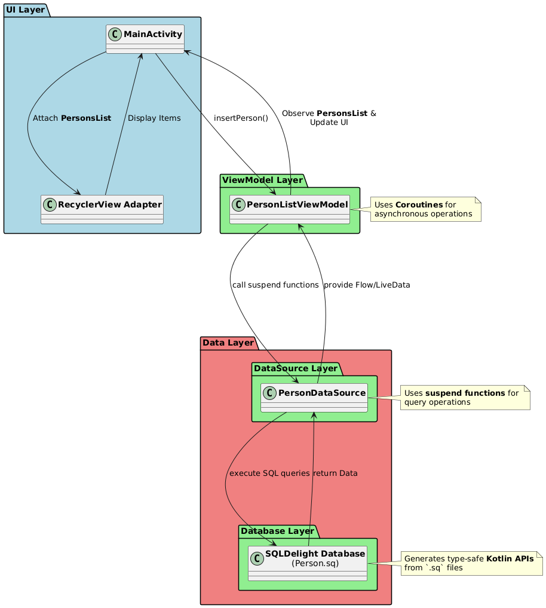

# SQLDelight Android App

An Android app for managing a simple list of people, built with Kotlin and SQLDelight for local, type-safe database access. Users can add, view, and delete persons, with all data stored locally on the device.

---

## ✨ Features

* View a list of persons in a `RecyclerView`.
* Add new persons with a first and last name.
* Delete persons via a delete button in each list item.
* Offline storage using **SQLDelight**.

---

## 🛠 Tech Stack

* **UI**: Android SDK (XML layouts, `RecyclerView`, `ConstraintLayout`)
* **Language**: Kotlin
* **Database**: SQLDelight (SQLite wrapper with generated Kotlin APIs)
* **Architecture**: MVVM (ViewModel, LiveData/Flow, Repository/DataSource)
* **Concurrency**: Coroutines for async database operations
* **UI Updates**: `DiffUtil` for efficient `RecyclerView` updates

---

## 🏛️ Architecture (MVVM)

The app follows the Model-View-ViewModel (MVVM) architectural pattern. This separates the UI from the business logic, making the code more modular, testable, and maintainable.

* **View (Activity/Fragment)**: Observes the ViewModel for data changes and forwards user actions.
* **ViewModel**: Holds and processes UI-related data. It survives configuration changes and communicates with the Repository.
* **Model (Repository/DataSource)**: Manages the data sources, fetching data from the local SQLDelight database.

Here is a diagram illustrating the structure:



## 📂 Key Project Structure
```
src/main/java/com/example/sqldelightapp/
├── ui/                     → Activities, Adapters, ViewHolders
└── db/                     → Database/DataSource logic

src/main/sqldelight/        → SQL schema & queries (.sq files)

res/layout/                 → XML layouts (activity_main, list_item_person)
```

## ⚙️ How It Works
1. The PersonDatabase is initialized via SQLDelight’s generated Kotlin code.
2. The ViewModel uses Kotlin Coroutines to make asynchronous calls (e.g., insert, delete) to the Repository/DataSource.
3. The list of persons is collected from the database as a Flow<List<Person>>.
4. This Flow is passed from the ViewModel to the UI layer and submitted to the RecyclerView adapter.
5. DiffUtil calculates the difference between the old and new lists, ensuring smooth and efficient UI updates whenever the data changes.
